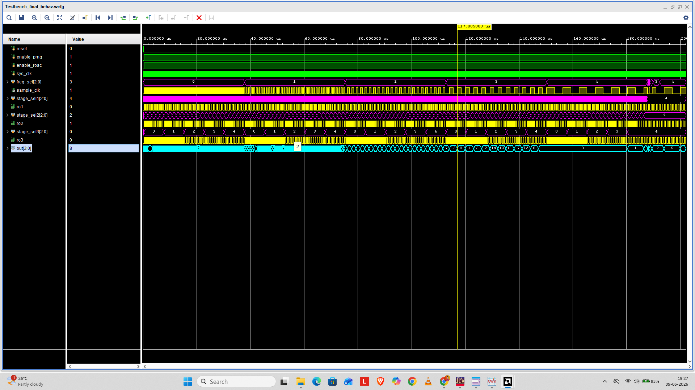

# Configurable Ring-Oscillator Based True Random Number Generator (TRNG)

## Project Overview
This repository contains a complete, synthesizable Verilog implementation of a hardware-centric True Random Number Generator (TRNG). The design harvests intrinsic thermal noise and phase jitter from three independent, dynamically configurable Ring Oscillators (ROs) to produce high-entropy random bitstreams. 

The system includes an integrated frequency scaling block and variable stage-selection multiplexers to optimize and evaluate entropy generation across varying operating conditions—crucial for cryptographic applications, secure key generation, and hardware security anchors.

---

## Architecture & Circuit Design

The TRNG architecture is divided into four distinct hierarchical sub-modules:

1. **Entropy Source (RingOsc_final.v)**: Comprises three distinct Ring Oscillators configured with structural inverter chains (u0 to u10). A runtime feedback multiplexer dictates the active delay path (selecting from 3, 5, 7, 9, or 11 inverter stages), allowing dynamic frequency shifting of the raw entropy generation.
2. **Metastability & Mixing Logic (trng_final.v)**: Uses a multi-stage synchronization topology where ro1 samples ro2 to deliberately invoke meta-stable hardware states. The resulting bitstream is mixed via a spatial XOR network with ro3 to generate the raw random bit sequence.
3. **Whitening Filter Loop**: To minimize DC bias (0/1 asymmetry), a dynamic algorithmic feedback loop (random_bit ^ out[0] ^ out[1]) whitens the stream before pushing it into a 4-bit output shift register.
4. **Frequency Selector (Freqsel_final.v)**: A programmable synchronous clock divider that accepts a high-speed master clock (sys_clk) and produces a flexible sample_clk controlled by a 3-bit selection vector (freq_sel).

---

## Repository Directory Structure

To maintain clean, professional VLSI repository standards, the project files are organized as follows:

📦 TRNG-Verilog
 ┣ 📂 rtl
 ┃ ┣ 📜 trng_final.v       # Top-level TRNG module, mixing network, and whitening
 ┃ ┣ 📜 RingOsc_final.v    # Structural Ring Oscillator module with feedback MUX
 ┃ ┗ 📜 Freqsel_final.v    # Clock division network / programmable sample clock
 ┣ 📂 tb
 ┃ ┗ 📜 Testbench_final.v  # Testbench executing exhaustive 5x5x5 parametric sweeps
 ┣ 📂 waveforms
 ┃ ┗ 📜 simulation_wave.png # Behavioral waveform screenshot from Vivado
 ┗ 📜 README.md            # Project documentation and analysis

---

## Behavioral Simulation & Verification

Verification is performed via an intensive, nested parametric test sequence in Testbench_final.v. The simulation executes a 3D matrix sweep (5x5x5x5 iterations) testing combinations of sampling frequencies and individual RO delay depths to analyze entropy behavior.

### Simulation Waveform Analysis
The timing waveform validates correct functionality under dynamic adjustments:

### Key Observations from Waveform:
* **sys_clk & sample_clk**: Demonstrates reliable operation of the clock division block during frequency scaling transitions.
* **stage_sel1 / ro1**: Illustrates real-time tuning of the ring oscillator's frequency as the feedback tap selections shift dynamically.
* **out[3:0]**: Demonstrates the continuous generation of non-deterministic values over time, confirming the output register shifts cleanly on sample_clk edges.

---

## Technical Implementation Details
* **Hardware Description Language**: Verilog 
* **Simulation/Synthesis Tools**: Xilinx Vivado Design Suite
* **Time Scale Resolution**: 1ns / 1ps
* **Target Master Frequency**: 100 MHz (sys_clk)

## Quick Start (Running Simulation)
1. Clone the repository or download the files from Chrome.
2. Load the source files from the rtl/ directory into your EDA workspace (e.g., Vivado or ModelSim).
3. Associate tb/Testbench_final.v as your top-level simulation file.
4. Run the behavioral simulation to view console logs tracking $display statements showing FreqSel, stage indices, and the corresponding output random integer values.
